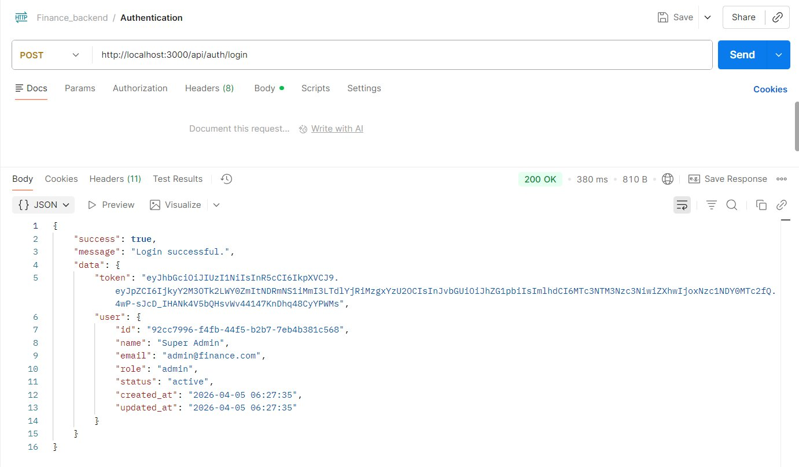
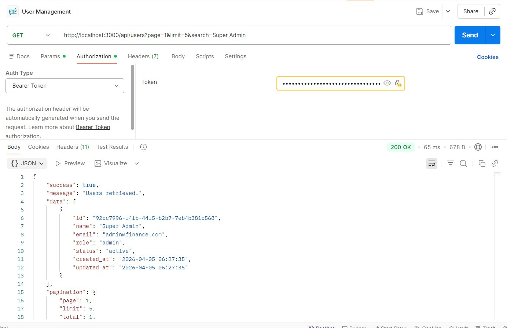
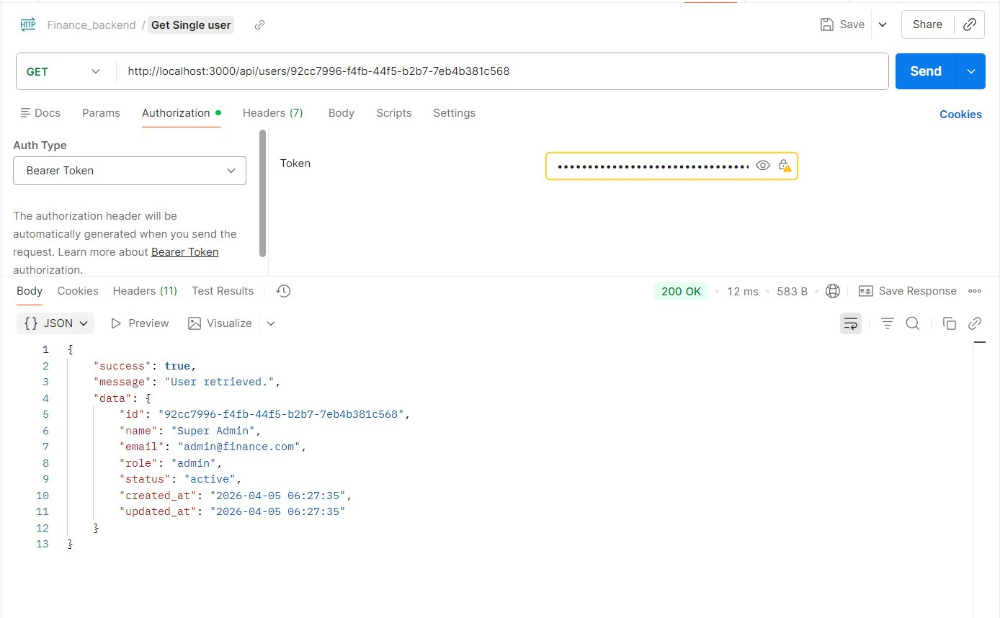
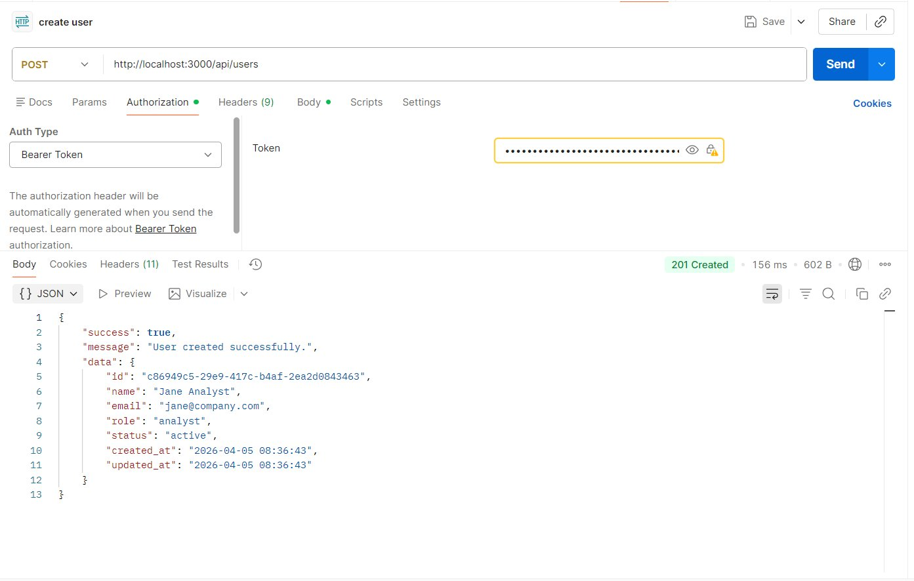
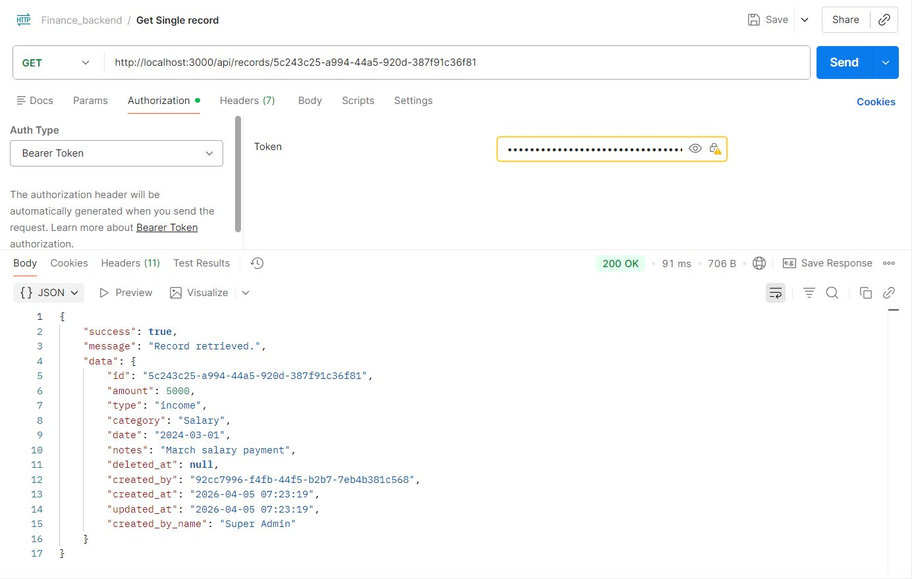
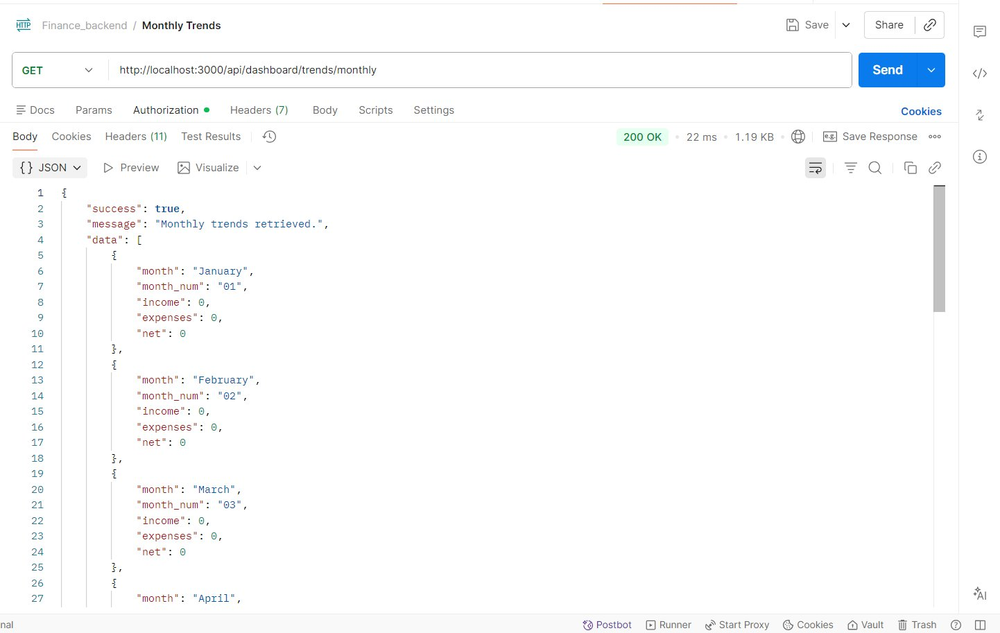
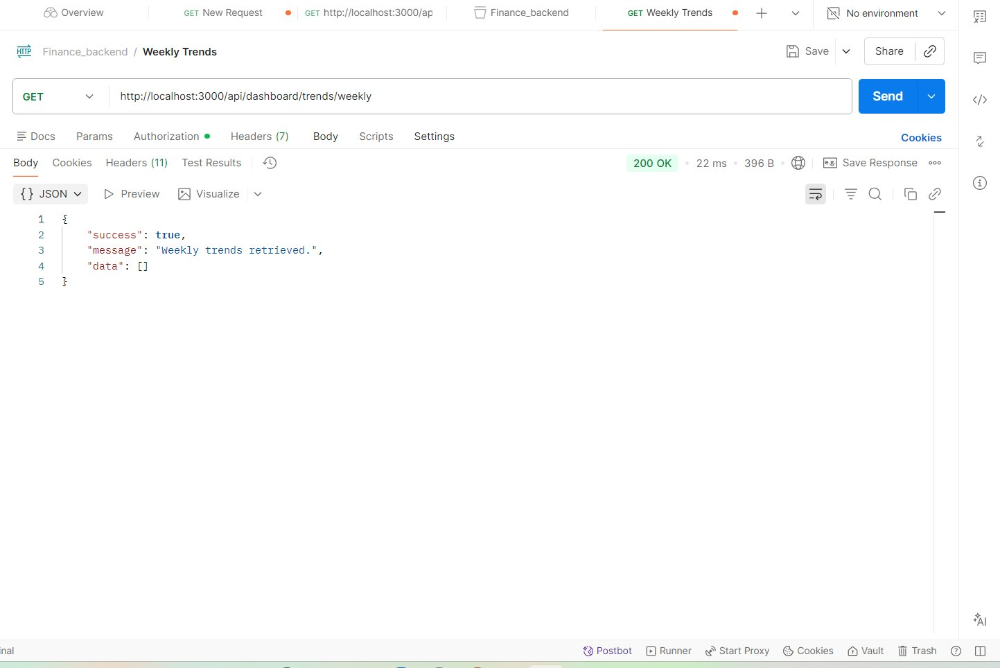

# Finance Backend API

A production-grade REST API for a finance dashboard system featuring role-based access control, JWT authentication, financial record management, and aggregated analytics.

---

## Table of Contents

- [Tech Stack](#tech-stack)
- [Architecture Overview](#architecture-overview)
- [Project Structure](#project-structure)
- [Setup & Installation](#setup--installation)
- [Environment Variables](#environment-variables)
- [Running the Server](#running-the-server)
- [Database Files Explained](#database-files-explained)
- [Running Tests](#running-tests)
- [Role & Permission Matrix](#role--permission-matrix)
- [Middleware & Access Control](#middleware--access-control)
- [API Reference](#api-reference)
- [API Testing — Postman Screenshots](#api-testing--postman-screenshots)
- [Assumptions & Design Decisions](#assumptions--design-decisions)
- [Optional Features Implemented](#optional-features-implemented)

---

## Tech Stack

| Layer         | Technology                           |
|--------------|---------------------------------------|
| Runtime       | Node.js (v18+)                       |
| Framework     | Express.js                           |
| Database      | SQLite via `better-sqlite3`          |
| Auth          | JWT (`jsonwebtoken` + `bcryptjs`)    |
| Validation    | Zod                                  |
| Logging       | Morgan                               |
| Rate Limiting | `express-rate-limit`                 |
| Testing       | Jest + Supertest                     |

---

## Architecture Overview

The project follows a layered architecture with clear separation of concerns:

```
Request → Route → Middleware Chain → Controller → Service → Database
                        ↓
           (auth, authz, validation,
            rate limiting, error handling)
```

| Layer           | Responsibility                                                   |
|----------------|-------------------------------------------------------------------|
| **Routes**      | Define endpoints, apply middleware chains                        |
| **Controllers** | Parse request/response, delegate to services                     |
| **Services**    | All business logic, DB queries, data transformation              |
| **Middlewares** | Cross-cutting concerns: auth, authorization, validation, errors  |
| **Validators**  | Zod schemas for request body and query string validation         |
| **Utils**       | JWT helpers, response formatter, pagination builder              |

---

## Project Structure

```
finance-backend/
├── src/
│   ├── config/
│   │   ├── database.js          # DB connection, schema init, admin seeding
│   │   └── constants.js         # Roles, permissions, enums
│   ├── controllers/
│   │   ├── auth.controller.js
│   │   ├── user.controller.js
│   │   ├── record.controller.js
│   │   └── dashboard.controller.js
│   ├── middlewares/
│   │   ├── auth.middleware.js        # JWT verification, user hydration
│   │   ├── authorize.middleware.js   # Role & permission-based access control
│   │   ├── validate.middleware.js    # Zod body/query validation
│   │   ├── error.middleware.js       # Global error handler + 404
│   │   └── rateLimiter.middleware.js # Per-route rate limiting
│   ├── routes/
│   │   ├── index.js
│   │   ├── auth.routes.js
│   │   ├── user.routes.js
│   │   ├── record.routes.js
│   │   └── dashboard.routes.js
│   ├── services/
│   │   ├── auth.service.js
│   │   ├── user.service.js
│   │   ├── record.service.js
│   │   └── dashboard.service.js
│   ├── utils/
│   │   ├── jwt.js
│   │   ├── pagination.js
│   │   └── response.js
│   ├── validators/
│   │   ├── user.validator.js
│   │   └── record.validator.js
│   ├── app.js                   # Express setup, middleware stack, routes
│   └── server.js                # Entry point — DB init, seed, server start
├── tests/
│   ├── helpers.js               # In-memory DB setup, test fixtures
│   ├── auth.test.js
│   ├── records.test.js
│   └── dashboard.test.js
├── .env.example
├── .gitignore
├── package.json
└── README.md
```

---

## Setup & Installation

### Prerequisites

- **Node.js** v18 or higher
- **npm** v8 or higher
- **Build tools** required by `better-sqlite3` for native compilation:

**Ubuntu/Debian:**
```bash
sudo apt-get install python3 make g++
```

**macOS:**
```bash
xcode-select --install
```

**Windows:** Install [Windows Build Tools](https://github.com/nodejs/node-gyp#on-windows) via npm or Visual Studio.

### Installation Steps

```bash
# 1. Unzip and enter the project directory
cd finance-backend

# 2. Install dependencies
npm install

# 3. Set up environment config
cp .env.example .env

# 4. (Optional) Edit .env to change JWT secret or port
```

---

## Environment Variables

| Variable         | Default                            | Description                           |
|-----------------|------------------------------------|---------------------------------------|
| `PORT`           | `3000`                             | HTTP server port                      |
| `JWT_SECRET`     | `finance_super_secret_jwt_key_...` | Secret key for signing JWTs           |
| `JWT_EXPIRES_IN` | `24h`                              | Token expiry duration                 |
| `NODE_ENV`       | `development`                      | `development` / `production` / `test` |
| `DB_PATH`        | `./finance.db`                     | SQLite database file path             |

> ⚠️ Always set a strong `JWT_SECRET` in production. Never commit `.env` to version control.

---

## Running the Server

```bash
# Development — with auto-reload via nodemon
npm run dev

# Production
npm start
```

On first run, the server automatically:
1. Creates the SQLite database file at `DB_PATH`
2. Executes schema creation (`CREATE TABLE IF NOT EXISTS`)
3. Seeds a default admin account if none exists

**Default Admin Credentials:**
```
Email:    admin@finance.com
Password: admin123
```

**Expected terminal output:**
```
✅ Default admin seeded: admin@finance.com / admin123
🚀 Finance Backend running on http://localhost:3000
📋 Environment : development
❤️  Health check: http://localhost:3000/health
```

---

## Database Files Explained

After starting the server for the first time, three SQLite-related files appear in the project root. This is **normal and expected** behavior.

### `finance.db` — Main Database
The primary SQLite database file. All tables, rows, and persisted data live here. This is the only file that needs to be backed up.

### `finance.db-shm` — Shared Memory File
A temporary index and coordination file used by SQLite to safely manage access when multiple readers query the database at the same time. It is auto-created and auto-managed — never edit or delete it manually.

### `finance.db-wal` — Write-Ahead Log
Instead of writing changes directly into `finance.db`, SQLite first records them in this log file. Changes are then **checkpointed** (merged) into the main database at a safe point. This is what enables concurrent reads during writes.

**Why WAL mode is enabled in this project:**

```js
// src/config/database.js
db.pragma("journal_mode = WAL");
```

WAL mode was chosen deliberately because it allows **reads and writes to occur simultaneously without blocking each other** — critical for a finance dashboard where analytics queries and record inserts can happen at the same time.

**Summary for evaluators:**
- All three files are fully auto-managed by SQLite
- They are excluded from version control via `.gitignore`
- On a clean shutdown, SQLite checkpoints the WAL and these auxiliary files shrink or disappear
- Only `finance.db` needs to be preserved for data backup

---

## Running Tests

Tests use an **in-memory SQLite database** — no file is created on disk and no manual cleanup is needed between runs.

```bash
npm test
```

**Test coverage includes:**

| Area           | Scenarios Covered                                              |
|---------------|----------------------------------------------------------------|
| Auth           | Valid/invalid login, inactive account blocking, missing token  |
| Records        | Full CRUD, validation errors (negative amount, bad date format)|
| Access Control | Viewer/Analyst blocked from write operations (403 verified)    |
| Dashboard      | Summary accuracy, analyst access to insights, viewer restrictions |

---

## Role & Permission Matrix

| Action                       | Admin | Analyst | Viewer |
|------------------------------|:-----:|:-------:|:------:|
| Login / View own profile     | ✅    | ✅      | ✅     |
| List / view users            | ✅    | ❌      | ❌     |
| Create user                  | ✅    | ❌      | ❌     |
| Update user (role/status)    | ✅    | ❌      | ❌     |
| Delete user                  | ✅    | ❌      | ❌     |
| List / view records          | ✅    | ✅      | ✅     |
| Create record                | ✅    | ❌      | ❌     |
| Update record                | ✅    | ❌      | ❌     |
| Delete record (soft)         | ✅    | ❌      | ❌     |
| Dashboard summary            | ✅    | ✅      | ✅     |
| Recent activity              | ✅    | ✅      | ✅     |
| Category breakdown (insight) | ✅    | ✅      | ❌     |
| Monthly trends (insight)     | ✅    | ✅      | ❌     |
| Weekly trends (insight)      | ✅    | ✅      | ❌     |

---

## Middleware & Access Control

Every protected route passes through a middleware chain before reaching the controller:

```
authenticate → can('PERMISSION') → validate(schema) → controller
```

### `authenticate` — `auth.middleware.js`
Extracts and verifies the `Bearer` JWT from the `Authorization` header. Re-fetches the user from the database on every request to catch mid-session deactivations. Attaches the full user object to `req.user`.

### `can(permission)` — `authorize.middleware.js`
Checks `req.user.role` against the permission map in `constants.js`. Returns `403 Forbidden` if the role is not permitted. Usage example: `can('CREATE_RECORD')` — only `admin` passes.

### `validate(schema)` — `validate.middleware.js`
Validates `req.body` or `req.query` against a Zod schema. Returns `422 Unprocessable Entity` with field-level error messages on failure.

### `globalErrorHandler` — `error.middleware.js`
Catches any unhandled error passed via `next(err)`. Handles SQLite constraint violations with appropriate HTTP codes. Prevents stack traces from reaching clients in production.

### Rate Limiting — `rateLimiter.middleware.js`
- **General API:** 100 requests / 15 min per IP
- **Auth routes:** 10 requests / 15 min per IP (brute-force protection on login)

---

## API Reference

### Standard Response Envelope

```json
// Success
{ "success": true, "message": "...", "data": { } }

// Paginated
{ "success": true, "message": "...", "data": [ ],
  "pagination": { "page": 1, "limit": 10, "total": 42,
                  "totalPages": 5, "hasNext": true, "hasPrev": false }}

// Error
{ "success": false, "message": "...",
  "errors": [{ "field": "amount", "message": "Must be > 0" }] }
```

---

### Auth Endpoints

| Method | Endpoint          | Auth | Description                    |
|--------|-------------------|:----:|--------------------------------|
| POST   | `/api/auth/login` | ❌   | Login and receive a JWT token  |
| GET    | `/api/auth/me`    | ✅   | Get authenticated user profile |

**Login request body:**
```json
{ "email": "admin@finance.com", "password": "admin123" }
```

---

### User Endpoints *(Admin only)*

| Method | Endpoint         | Description                            |
|--------|------------------|----------------------------------------|
| GET    | `/api/users`     | List users — supports `search`, `role`, `status`, `page`, `limit` |
| GET    | `/api/users/:id` | Get a single user by ID                |
| POST   | `/api/users`     | Create a new user                      |
| PUT    | `/api/users/:id` | Update name, role, or status           |
| DELETE | `/api/users/:id` | Hard-delete user (cannot delete self)  |

---

### Financial Record Endpoints

| Method | Endpoint           | Roles Allowed          | Description                      |
|--------|--------------------|------------------------|----------------------------------|
| GET    | `/api/records`     | Admin, Analyst, Viewer | List with filter/search/paginate |
| GET    | `/api/records/:id` | Admin, Analyst, Viewer | Get single record                |
| POST   | `/api/records`     | Admin only             | Create record                    |
| PUT    | `/api/records/:id` | Admin only             | Update record (partial)          |
| DELETE | `/api/records/:id` | Admin only             | Soft-delete record               |

**Query params for `GET /api/records`:**

| Param       | Description                                  |
|------------|----------------------------------------------|
| `page`      | Page number (default: 1)                     |
| `limit`     | Items per page (default: 10, max: 100)       |
| `type`      | `income` or `expense`                        |
| `category`  | Partial match filter                         |
| `startDate` | `YYYY-MM-DD` inclusive lower bound           |
| `endDate`   | `YYYY-MM-DD` inclusive upper bound           |
| `search`    | Free-text search on `category` and `notes`   |
| `sortBy`    | `date`, `amount`, or `created_at`            |
| `sortOrder` | `asc` or `desc` (default: `desc`)            |

**Create record request body:**
```json
{
  "amount": 5000.00,
  "type": "income",
  "category": "Salary",
  "date": "2024-03-01",
  "notes": "March salary payment"
}
```

---

### Dashboard Endpoints

| Method | Endpoint                        | Roles Allowed  | Description                         |
|--------|---------------------------------|----------------|-------------------------------------|
| GET    | `/api/dashboard/summary`        | All roles      | Total income, expenses, net balance |
| GET    | `/api/dashboard/recent`         | All roles      | Most recent N records               |
| GET    | `/api/dashboard/categories`     | Admin, Analyst | Income/expense totals by category   |
| GET    | `/api/dashboard/trends/monthly` | Admin, Analyst | Monthly breakdown (by year)         |
| GET    | `/api/dashboard/trends/weekly`  | Admin, Analyst | Weekly breakdown (current month)    |

---

## API Testing — Postman Screenshots

All endpoints were tested manually using Postman. Screenshots below demonstrate correct responses across all modules.

---

### Health Check
`GET /health` — Verifies the server is running. No authentication required.


> **200 OK** — Returns server status, timestamp, and environment.

---

### Login — JWT Authentication
`POST /api/auth/login` — Authenticates with admin credentials and returns a signed JWT.



> **200 OK** — Returns the JWT token and full user profile. Password field is never included in any response.

---

### Get My Profile
`GET /api/auth/me` — Returns the authenticated user's profile via Bearer token.


> **200 OK** — Demonstrates the `authenticate` middleware correctly identifying the current user from the token.

---

### List Users with Search & Pagination
`GET /api/users?page=1&limit=5&search=Super Admin`



> **200 OK** — Returns a paginated user list with `pagination` metadata. Accessible to Admin only.

---

### Get Single User
`GET /api/users/:id`



> **200 OK** — Admin retrieves a specific user by UUID.

---

### Create User
`POST /api/users` — Admin creates a new analyst user.



> **201 Created** — New user returned with role `analyst` and status `active`.

---

### Update User
`PUT /api/users/:id` — Admin updates name, role, and status in a single request.


> **200 OK** — Role changed to `viewer`, status set to `inactive`. `updated_at` reflects the change.

---

### Delete User
`DELETE /api/users/:id`


> **200 OK** — Hard delete confirmed. Attempting to delete own account returns `400 Bad Request`.

---

### List Financial Records
`GET /api/records` — Lists all active (non-deleted) records.


> **200 OK** — Available to all roles. Each record includes `created_by_name` joined from the users table.

---

### Get Single Record
`GET /api/records/:id`



> **200 OK** — Returns the full record object. Returns `404` if the record has been soft-deleted.

---

### Create Financial Record
`POST /api/records` — Admin creates a new income record.


> **201 Created** — `created_by` is automatically set from the authenticated user's ID.

---

### Update Financial Record
`PUT /api/records/:id` — Admin updates amount, category, and notes.


> **200 OK** — Partial update applied. `updated_at` reflects the modification timestamp.

---

### Delete Financial Record (Soft Delete)
`DELETE /api/records/:id`


> **200 OK** — Record flagged with `deleted_at` and excluded from all future queries. Data is preserved in the database for audit purposes.

---

### Dashboard Summary
`GET /api/dashboard/summary` — Top-level financial totals. Accessible by all roles.


> **200 OK** — Shows `total_income: 10000`, `total_expenses: 0`, `net_balance: 10000` across 2 active records.

---

### Recent Activity
`GET /api/dashboard/recent` — Most recently created records. Accessible by all roles.


> **200 OK** — Returns records ordered by `created_at` descending, with `created_by_name`.

---

### Category Breakdown
`GET /api/dashboard/categories` — Income/expense totals by category. Admin and Analyst only.


> **200 OK** — Salary category: `income: 10000`, `expense: 0`, `total_transactions: 2`. Viewers receive `403`.

---

### Monthly Trends
`GET /api/dashboard/trends/monthly` — All 12 months for the current year. Admin and Analyst only.



> **200 OK** — Always returns all 12 months. Months with no data show zeroes, ensuring a consistent chart-ready structure.

---

### Weekly Trends
`GET /api/dashboard/trends/weekly` — Weekly breakdown for the current month. Admin and Analyst only.



> **200 OK** — Empty array when no records exist in the current month — correct and expected behavior.

---

## Assumptions & Design Decisions

1. **Soft deletes for records, hard deletes for users.** Financial records are soft-deleted to preserve audit history. Users are hard-deleted since `created_by_name` is stored as a denormalized snapshot on the record at creation time.

2. **Analysts are read-only.** Per the assignment spec, analysts can read records and access insights but cannot create or modify data. Data entry is an admin-only responsibility.

3. **JWT payload includes role, but user is re-fetched on every request.** This ensures that if an admin deactivates a user mid-session, the next request is blocked immediately — a deliberate security tradeoff over pure stateless JWT.

4. **WAL mode enabled on SQLite.** `PRAGMA journal_mode = WAL` allows concurrent reads during writes, which is important for a dashboard serving analytics queries and accepting record inserts simultaneously.

5. **Foreign keys enforced at the DB level.** `PRAGMA foreign_keys = ON` is set on every connection, providing a safety net beyond application-level checks.

6. **Passwords are never returned.** A `sanitizeUser()` helper strips the `password` field before any user object reaches the response layer, across all endpoints.

7. **Amount is `REAL` with `CHECK > 0`.** Positive-only amounts are enforced at both the Zod validation layer and the SQLite schema level — two independent safeguards.

8. **Dates stored as `TEXT` in `YYYY-MM-DD` format.** SQLite has no native `DATE` type. ISO 8601 text format sorts and compares correctly lexicographically, which is idiomatic for SQLite date handling.

---

## Optional Features Implemented

| Feature                  | Status | Notes                                                |
|--------------------------|:------:|------------------------------------------------------|
| JWT Authentication       | ✅     | Bearer token, 24h expiry, re-validated per request   |
| Pagination               | ✅     | All list endpoints — configurable `page` and `limit` |
| Search support           | ✅     | Full-text search across `category` and `notes`       |
| Soft deletes             | ✅     | `deleted_at` timestamp; excluded from all queries    |
| Rate limiting            | ✅     | 100 req/15min general · 10 req/15min on auth routes  |
| Integration tests        | ✅     | Jest + Supertest with in-memory SQLite               |
| API documentation        | ✅     | Full endpoint reference in this README               |
